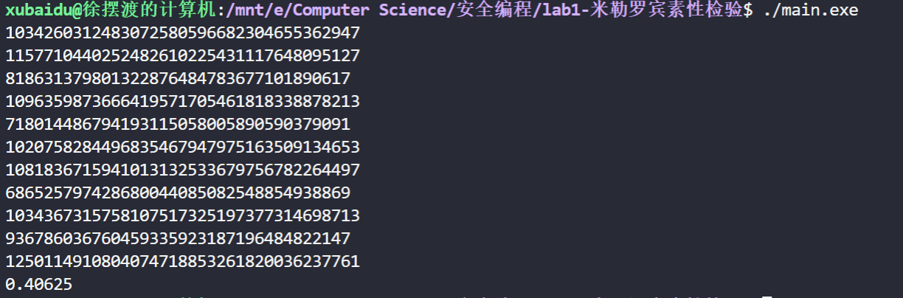

# 生成大素数

## 项目简介

代码生成 ```10``` 个 ```120-bit``` 大素数并输出运行时间

运行环境：```c++ in linux```

## 文件解释

```bigInteger.cpp``` 编写大整数代码，其中乘法和除法为普通算法，没有 ```FFT``` 优化，属于低级轮子

```gen.py``` 用来生成测试大整数代码正确性

```in.txt``` 为生成的测试大整数代码的数据

```main.cpp``` 和 ```main_bigInt.cpp``` 分别为 ```__int128``` 级别的 ```miller-rabin``` 和大整数级别的 ```miller-rabin```

```prob.png``` 为运行截图

## 运行截图


