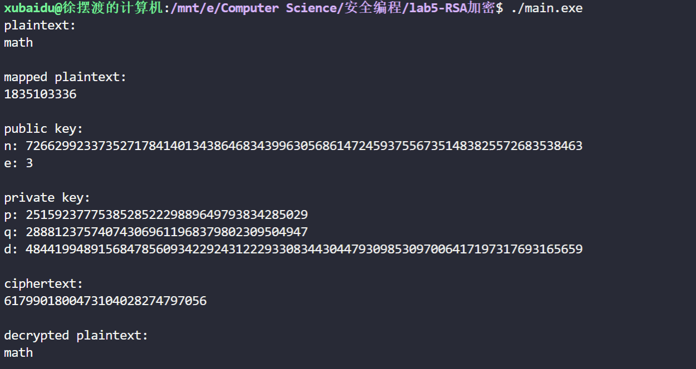

# RSA

## 项目简介

实现 $RSA$ 非对称加密

生成两个 ```128-bit``` 大整数 $p,\ q$，构造 $n = pq$

选取 $e$ 满足 $(e, \phi(n)) = 1$，计算 $d = e^{-1}\ mod\ \phi(n)$

用 $n,\ e$ 作为公钥，$p,\ q,\ e$ 作为私钥，对 ```"math"``` 进行非对称加密解密

本次项目使用了 ```lab-1``` 的大整数模板和 ```miller-rabin``` 模板

运行环境: ```c++ in linux```

## 效果

