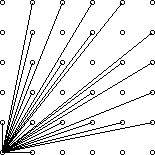

# problems

## 1471. 欧拉函数

给定 $n$，计算 $\phi(2) \oplus \phi(3) \oplus ..  \ \phi(n)$，其中 $\oplus$ 表示异或

规定 $1\leq n\leq 1,000,000$

## 2609. 欧拉降幂

给定 $a,\ m,\ b$，计算 $a^b\ mod\ m$

输入保证

$1\leq a\leq 1,000,000,000$

$1\leq m\leq 100,000,000$

$1\leq b\leq 10^{100,000}$

## 2610 仪仗队

给定 $N$，表示有一个 $N\times N$ 的仪仗队，$C$ 站在左下角，计算他所看到的人数

$1\leq N\leq 40,000$