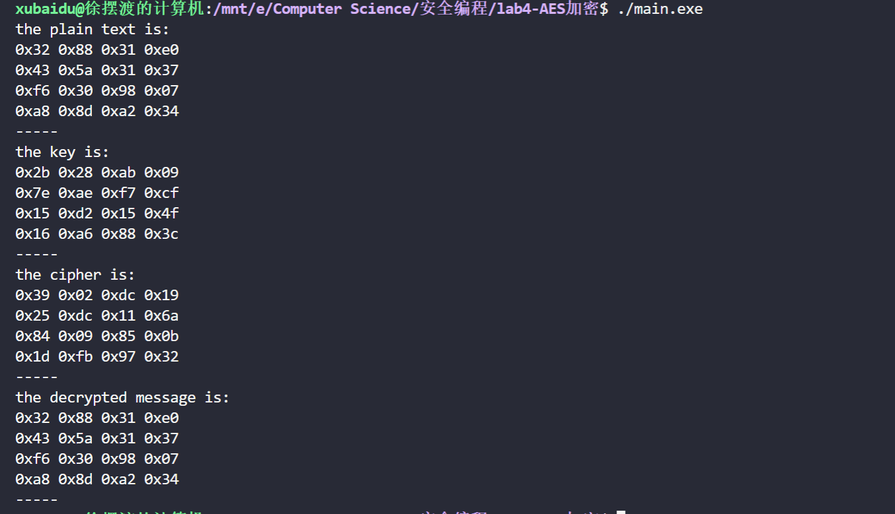

# readme

实现 AES 算法，密钥长度为 ```128-bit```

明文

```cpp
uint8_t plain[4][4] = {
        {0x32, 0x88, 0x31, 0xe0},
        {0x43, 0x5a, 0x31, 0x37},
        {0xf6, 0x30, 0x98, 0x07},
        {0xa8, 0x8d, 0xa2, 0x34}};
```

初始密钥

```cpp
uint8_t key[4][4] = {
        {0x2b, 0x28, 0xab, 0x09},
        {0x7e, 0xae, 0xf7, 0xcf},
        {0x15, 0xd2, 0x15, 0x4f},
        {0x16, 0xa6, 0x88, 0x3c}};
```

效果如图


