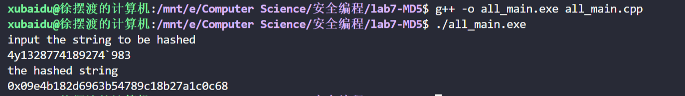
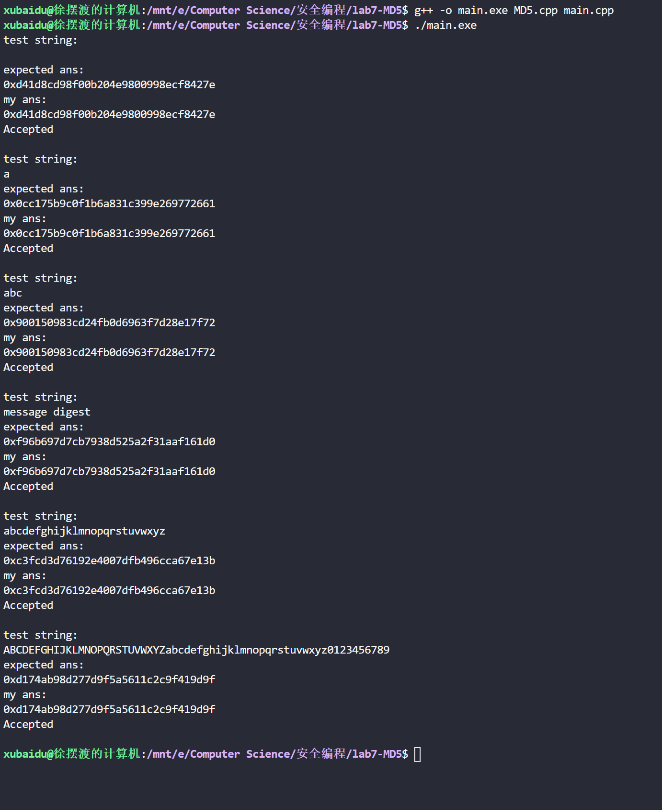

# MD5

## 项目描述

实现 MD5 hash，即给定任意字符串，将其转化成 ```128-bit``` 的 ```01``` 串，用十六进制表示

## 文件说明

代码使用面向对象封装 ```MD5```

```all_main.cpp``` 是单文件实现 ```MD5```，可以直接编译运行

```MD5.h``` 为头文件，```MD5.cpp``` 为类实现，```main.cpp``` 为测试程序，测试数据内嵌，三个文件一起编译可以得到结果

## 实现效果





## 参考资料

[MD5 wikipedia](https://en.wikipedia.org/wiki/MD5#Implementations)

[online MD5 calculator](http://www.md5.cz/)

[⭐an extremely helpful debugger](https://cse.unl.edu/~ssamal/crypto/genhash.php)
