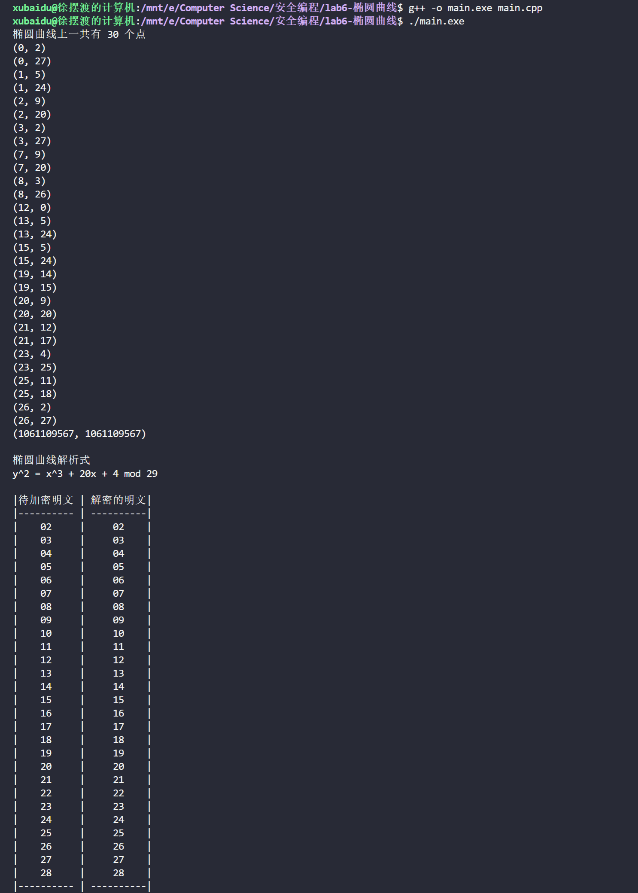

# 椭圆曲线

## 项目简介

实现椭圆曲线上的 El-gamal 加密

具体算法可以参考博客 [EL Gamal 密码方案的椭圆曲线形式](https://www.cnblogs.com/ChenyangXu/p/14180803.html)

本代码封装了椭圆曲线类，使得代码更易扩展复用

在 main 函数中使用构造函数构造一个椭圆曲线类和一个 ```pair<int, int>``` 类型的点，就可以调用对应的加密算法

```cpp
pii P = {13, 24};
EllipticCurve E(20, 4, 29);
```

代码输出了椭圆曲线上的所有点，椭圆曲线的解析式，以及所有明文的解密情况

效果如图

